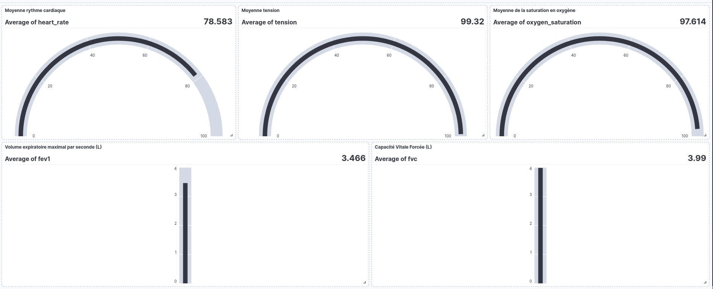

# MedAssist-CloudIoT 

This project involved implementing and creating a dashboard that retrieves data from IoT sensors and is accessible within a big data environment. The technologies utilized include Kubernetes, the ELK stack, and Python for simulating the sensors. Additionally, I deployed MailHog, a local mail server, as a proof of concept to demonstrate the alerting functionality.



# How Did I Manage That? 🤔

I will detail all the Kubernetes (k8s) commands I used to complete this project. Although I could have automated everything, I find it interesting to show the path I took. It helps in understanding how everything actually works. 🚀

## Launching Minikube 🚀

```sh
minikube start # Launch Minikube
minikube dashboard > /dev/null 2>&1 & # Access Kubernetes dashboard
eval $(minikube docker-env)  # Access Minikube environment and build container
```

## Installing ElasticSearch 🔍

```sh
# Installing CRD
kubectl create -f https://download.elastic.co/downloads/eck/2.16.1/crds.yaml

# Installing operator
kubectl apply -f https://download.elastic.co/downloads/eck/2.16.1/operator.yaml

# Check if the operator is running
kubectl get -n elastic-system pods

# Creating the pods (this will take some time)
kubectl apply -f k8s/elasticsearch.yaml
kubectl apply -f k8s/kibana.yaml
kubectl apply -f k8s/beats.yaml
```

## Accessing ElasticSearch 🌐

```sh
PASSWORD=$(kubectl get secret quickstart-es-elastic-user -o go-template='{{.data.elastic | base64decode}}')
echo $PASSWORD

# Use the password to connect to the website
kubectl port-forward service/quickstart-kb-http 5601 > /dev/null &
```

The website is available here: [https://localhost:5601](https://localhost:5601). The username is `elastic`, and the password is the one from the shell.

## Deploy MySQL 📦

```sh
# Information such as database name, username, etc., are stored in the .env file
# Because it's a proof of concept, it is available in this repository
kubectl create configmap mysql-config --from-env-file=.env
kubectl create secret generic mysql-secret --from-env-file=.env
kubectl apply -f k8s/mysql-deployment.yaml
```

To access these pods, use the following command:

```sh
kubectl run -it --rm --image=mysql:5.6 --restart=Never mysql-client -- mysql -h mysql -ppassword
```

In MySQL, you can run the following commands to see the database:

```sql
use medical_data;
show tables;
select * from measurements;
```

## Filling the Database with Patient and Measurements 📊

```sh
# Build the Docker image in the Minikube cluster
docker build --build-arg PASSWORD="$PASSWORD" -t python-api script/api

# Create the pod
kubectl apply -f k8s/python-api.yaml
```

The database will start to fill with sensor data.

## Alerting ⚠️

As a proof of concept, to show that data is being analyzed, I set up a dummy internal SMTP server. When the measurements are too high, an email is sent.

```sh
# Creating the SMTP
kubectl apply -f k8s/mailhog.yaml
kubectl port-forward service/mailhog-service 8025:8025 > /dev/null 2>&1 &
```

It is available here: [http://localhost:8025](http://localhost:8025).

The following pod will retrieve data from ElasticSearch, check the values, and send an email if the data is too high.

```sh
docker build --build-arg PASSWORD="$PASSWORD" -t python-alert script/alert
kubectl apply -f k8s/python-alert.yaml
```

Emails will start flooding in.

## Dashboard 📈

I created a dashboard and exported it. It's the file `healthcare_dashboard.ndjson`.

In ElasticSearch ([https://localhost:5601](https://localhost:5601)), go to: Stack Management > Saved Objects > Import.

Import the file `healthcare_dashboard.ndjson`.

Now, if you go to the burger menu, then Analytics > Dashboards, the dashboard will be there.

---